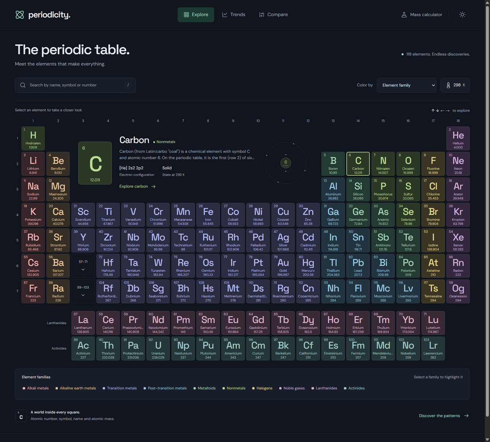

# Periodicity

An interactive atlas of all 118 chemical elements, rebuilt with **Bun, SvelteKit 3, Svelte 5, and TypeScript**.



Explore the periodic table, follow six periodic trends, compare up to four elements, and calculate molecular mass from a chemical formula.

## Run locally

Requires Bun 1.4.2 or newer. Dependencies and variable fonts are served locally; the application does not need external data requests.

```sh
bun install --frozen-lockfile
bun run dev
```

Open the local URL printed by Vite (normally `http://localhost:5173`).

```sh
bun run check       # Svelte and strict TypeScript diagnostics
bun test            # Reference data, temperatures, trends, and formula parsing
bun run build      # Prerender the application and all 118 element pages
bun run preview    # Serve the production build locally
bun run format     # Format the source and documentation
bun run format:check
```

## Explore

- **Periodic table:** Highlight a family; inspect an element; switch between family colors, physical states, and property heatmaps.
- **Quick molar mass:** Right-click element tiles to add atoms, or focus a tile and press Shift+Enter. Repeated elements become formula subscripts; the table preview shows the individual atomic masses and total in g/mol. On touch screens, select an element and use “Add [symbol] to mass.” Undo removes the last atom; Close or Escape clears the calculation. Open “Full calculator” for the formula’s composition and mass percentages.
- **Temperature:** Select “Physical state” in the left-hand “Color by” menu to show temperature controls and state counts on the right. The borderless controls are hidden in other coloring modes while retaining their layout space, so switching modes does not move the table. Explore estimated states from 0–6,000 K; adjusting the temperature activates physical-state coloring. This is an educational approximation at ordinary pressure. Missing measurements remain unknown, and transitions that do not define a liquid interval are handled separately.
- **Trends:** Switch between ionization energy, electronegativity, atomic radius, electron affinity, density, and melting point. Inspect exact values on an interactive chart or a sortable, searchable, paginated table. Missing data are represented by gaps, rather than zeroes.
- **Element pages:** Read the original summaries, electron configurations, discovery information, and physical properties; inspect an illustrative shell model; and navigate to neighboring elements.
- **Compare:** Click elements directly on the periodic table to compare up to four elements. Click a selected tile again or click its label to remove it, or clear the whole selection. Use arrow keys to move between tiles and Enter or Space to select. The full table scrolls horizontally on small screens. Compare atomic, physical, and chemical properties, and share selections through the URL.
- **Molar mass:** Enter formulas such as `H2O`, `C6H12O6`, `Ca(OH)2`, `K4[Fe(CN)6]`, or `CuSO4·5H2O`. Nested parentheses and brackets, pasted subscripts, and middle-dot hydrates are supported. Results include each element's contribution and mass percentage.

On small screens, the default element grid remains readable. The Table control shows the complete 18-group layout in a labeled scroll region. Selecting an element locks its preview; select it again to open its detail page. Family filtering remains available above the grid.

Use arrow keys to move around the desktop periodic table, and Enter or Space to select. All controls have visible focus indicators. Both appearances are paired independently, respect reduced motion, and remember the selected appearance when browser storage is available.

## Deployment

`bun run build` writes a fully prerendered static site to `build/`. Serve that directory with a static host that supports directory index files. Every element has its own HTML page at `/element/1/` through `/element/118/`, preserving the original numeric routes.

The static adapter also emits `404.html`. Configure your host to serve it for unknown paths. Do not deploy the source tree or Vite development server as the production site.

## Project structure

```text
src/routes/                 Explorer, trends, comparison, calculator, and element routes
src/lib/components/         Shared symbols, element tiles, shell model, and trend chart
src/lib/data/               Typed reference data, provenance, and regression tests
src/lib/chemistry/          Formula parser, molar mass calculation, and tests
src/app.css                 Paired theme tokens, fonts, and shared controls
design-system/periodicity/  Design decisions and interaction principles
```

Svelte 5 runes drive the interface. SvelteKit 3 uses package subpath imports (`#lib/*`) and its current configuration in `vite.config.ts`. URL state uses the effective shallow-navigation URL so repeated interactions preserve selections, display modes, temperature, and filters.

## Reference data

This rewrite preserves the original project's 118-element dataset and its curated property corrections. The original general records came from [Periodic-Table-JSON](https://github.com/Bowserinator/Periodic-Table-JSON); numeric properties came from `periodic-table@0.0.8`. Both are vendored as reference data. See [provenance and units](src/lib/data/PROVENANCE.md) and the [upstream data license](src/lib/data/periodic-table-LICENSE.txt).

Values are historical reference measurements, with some representative isotope mass numbers for unstable elements. Unknown properties remain unavailable. The displayed atomic radius is the source's covalent radius; electron affinity uses the energy-released convention, converted from the legacy electron-attachment enthalpy signs. The shell model shows electron counts, with illustrative positions.

## License

[MIT](LICENSE). Original project by Kadin Zhang and contributors.
